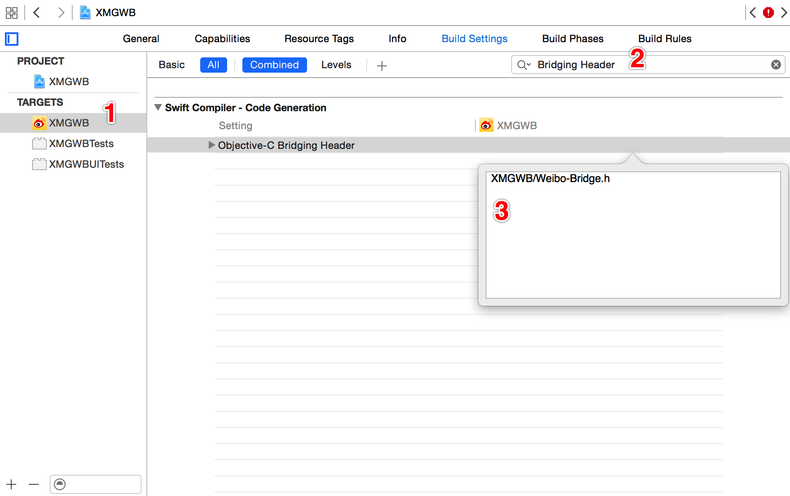

# SDWebImage & SVProgressHUD

## 目标

* 在项目中使用 CocoaPods 引入 OC 第三方框架
* OC & Swift 混编
* 基本使用

## 简介

* `SVProgressHUD` 是使用 OC 开发的指示器
* 使用非常广泛

## 框架地址

https://github.com/TransitApp/SVProgressHUD

### 与 `MBProgressHUD` 对比

* `SVProgressHUD`
    * 只支持 `ARC`
    * 支持较新的苹果 API
    * 提供有素材包
    * 使用更简单
* `MBProgressHUD`
    * 支持 `ARC` & `MRC`
    * 没有素材包，程序员需要针对框架进行一定的定制才能使用

## 安装

* 打开终端
* `$ cd` 进入项目目录
* 输入以下终端命令建立或编辑 `Podfile`

```bash
$ vim Podfile
```

* 输入以下内容

```
use_frameworks!
platform :ios, '7.0'
pod 'AFNetworking'
pod 'SDWebImage'
pod 'SVProgressHUD'
```

* `:wq` 保存退出

* 输入以下命令更新第三方框架

```bash
$ pod update
```

* 使用 Xcode 打开工作组文件
* 在 `Supporting Files` 下添加桥接文件 `Weibo-Bridge.h`
* 输入以下内容

```objc
#import <SDWebImage/UIImageView+WebCache.h>
#import <SVProgressHUD/SVProgressHUD.h>
```

* 点击 `项目` - `TARGETS` - `Build Settings`
* 搜索 `bridg`
* 在 `Objective-C Bridging Header` 中输入 `大神1期/Weibo-Bridge.h`，如下图所示：



## 使用

### 引入框架

* 在 OAuthViewController.swift 中添加如下代码：

```swift
import SVProgressHUD

SVProgressHUD.showInfoWithStatus("正在玩命加载中...", maskType: SVProgressHUDMaskType.Gradient)
```

### SDWebImage

```swift
import SDWebImage

let url = NSURL(string: "http://y3.ifengimg.com/cmpp/2015/07/31/10/3e2bad69-86d4-4855-a776-72e9494c3558_size49_w500_h320.jpg")!
SDWebImageManager.sharedManager().downloadImageWithURL(url, options: SDWebImageOptions.allZeros, progress: nil) { (image, _, _, _, _) in
    let data = UIImagePNGRepresentation(image)
    data.writeToFile("/Users/LNJ/Desktop/abc.jpg", atomically: true)
}
```

