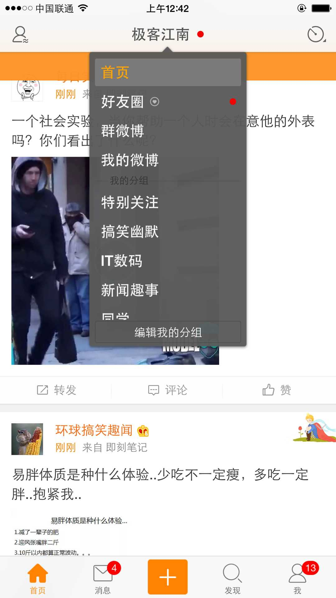

# 自定义导航栏

## 课程目标
* 利用 `UIPresentationController` 自定义 Modal 转场动画

## 功能需求

* 用户登录成功后，在首页导航栏的左右显示两个图标
    * 左侧显示 `好友信息` 图标
    * 右侧显示 `更多操作` 图标
* 用户登录成功后，导航栏标题显示一个按钮
    * 按钮标题是用户名
    * 按钮右侧有一个箭头标记
* 点击按钮
    * 点击`标题`按钮弹出一个表格，显示`编辑好友分组`
    * 点击`更多操作`按钮弹出一个表格，显示`更多操作`

