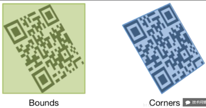

# 绘制线条

## AVMetadataMachineReadableCodeObject

* bounds
* corners



## 代码实现

* 坐标转换

```swift
// MARK: - 扫描数据代理
func captureOutput(captureOutput: AVCaptureOutput!, didOutputMetadataObjects metadataObjects: [AnyObject]!, fromConnection connection: AVCaptureConnection!) {

    for object in metadataObjects {
        let dataObject = previewLayer.transformedMetadataObjectForMetadataObject(object as! AVMetadataObject) as! AVMetadataMachineReadableCodeObject

        print(dataObject)
    }
}
```

* 转换结果

```
# 转换前
<AVMetadataMachineReadableCodeObject: 0x170220720,
type="org.iso.QRCode",
bounds={ 0.4,0.4 0.1x0.2 }>
corners { 0.4,0.6 0.5,0.6 0.5,0.4 0.4,0.4 },
time 155921691680958,
stringValue "http://weibo.cn/qr/userinfo?uid=5365823342"

# 转换后
<AVMetadataMachineReadableCodeObject: 0x170622cc0,
type="org.iso.QRCode",
bounds={ 116.6,224.9 79.5x80.0 }>
corners { 116.6,226.1 117.2,304.4 196.1,304.9 195.7,224.9 },
time 155921691680958,
stringValue "http://weibo.cn/qr/userinfo?uid=5365823342"
```

> 转换的目的是将采集到的坐标转换成能够识别的坐标数值

* 绘制图层

```swift
/// 绘制图层
lazy var drawLayer = CALayer()
```

* 添加图层

```swift
/// 设置图层
func setupLayers() {
    drawLayer.frame = view.bounds
    view.layer.insertSublayer(drawLayer, atIndex: 0)

    previewLayer.videoGravity = AVLayerVideoGravityResizeAspectFill
    previewLayer.frame = view.bounds
    view.layer.insertSublayer(previewLayer, atIndex: 0)
}
```

> 注意：一定要用 `insertSublayer`，否则会遮挡住 `TabBar`

* 创建路径 & 绘制条码形状

```swift
/// 绘制条码形状
private func drawCornersShape(dataObject: AVMetadataMachineReadableCodeObject) {
    // 判断数组是否为空
    if dataObject.corners.isEmpty {
        return
    }

    let layer = CAShapeLayer()
    layer.lineWidth = 4
    layer.strokeColor = UIColor.greenColor().CGColor
    layer.fillColor = UIColor.clearColor().CGColor
    layer.path = cornersPath(dataObject.corners)

    // 添加到绘图图层
    drawLayer.addSublayer(layer)
}

///  创建边线路径
///
///  -parameter corners: 边角顶点数组
private func cornersPath(corners: NSArray) -> CGPathRef {
    let path = UIBezierPath()
    var point = CGPoint()

    // 1. 移动到第一个点
    var index = 0
    CGPointMakeWithDictionaryRepresentation((corners[index++] as! CFDictionaryRef), &point)
    path.moveToPoint(point)

    // 2. 遍历剩余的点
    while index < corners.count {
        CGPointMakeWithDictionaryRepresentation((corners[index++] as! CFDictionaryRef), &point)
        path.addLineToPoint(point)
    }

    // 3. 关闭路径
    path.closePath()

    return path.CGPath
}
```

> 注意

* `corners` 是保存 `CFDictionary` 对象的数组
* 一定要判断 `corners` 是否包含数据，否则会崩溃

* 清空绘图图层

```swift
/// 清空绘图图层
private func clearDrawLayer() {
    if drawLayer.sublayers == nil {
        return
    }

    for layer in drawLayer.sublayers! {
        layer.removeFromSuperlayer()
    }
}
```

> 注意：一定要判断 `subLayers` 否则会崩溃

* 调整后的代码

```swift
func captureOutput(captureOutput: AVCaptureOutput!, didOutputMetadataObjects metadataObjects: [AnyObject]!, fromConnection connection: AVCaptureConnection!) {

    clearDrawLayer()

    for object in metadataObjects {

        if object is AVMetadataMachineReadableCodeObject {
            let dataObject = previewLayer.transformedMetadataObjectForMetadataObject(object as! AVMetadataObject) as! AVMetadataMachineReadableCodeObject

            drawCornersShape(dataObject)
            print(dataObject.stringValue)
        }
    }
}
```

> 一定要判断一下 object 的类型，否则遇到非 `CodeObject` 会直接崩溃

