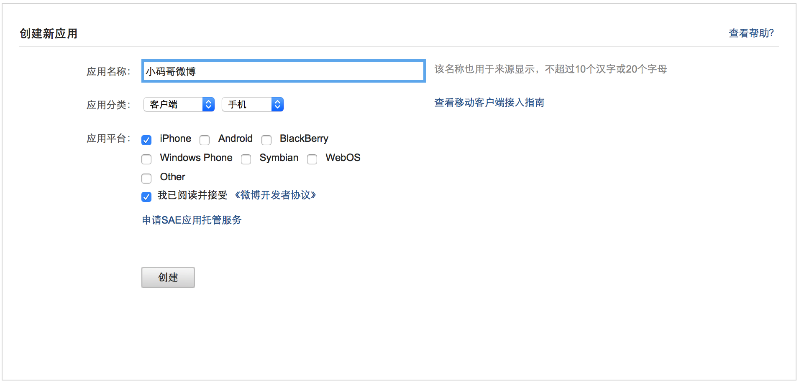

# 注册应用程序

## 注册应用程序

* 注册新浪微博账号
* 访问 http://open.weibo.com
* 点击 `微连接` - `移动应用`
* 填写基本信息，如下图所示：

* 点击 `应用信息` - `高级信息`，设置回调地址，如下图所示：

## 应用程序信息

| Key | 值 |
| -- | -- |
| client_id | 940792379 |
| client_secret | 52ff9b59980f2ea310fc21d3241f15f2 |
| redirect_uri | http://www.520it.com |
| access_token | 2.00ml8IrF0TdMlnj0528d4c123hT5qM |

> 注意：授权回调地址一定要完全一致
